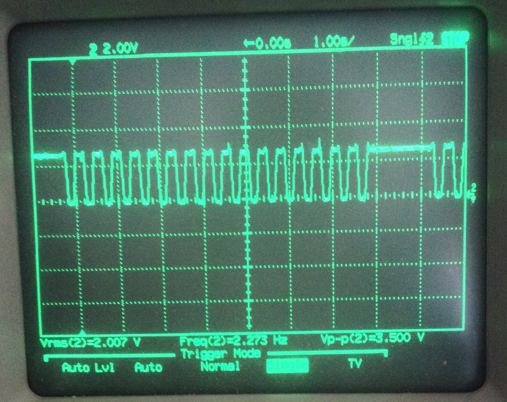

Information provided by Niels and Gerrit.

### System view
The LED driver, OKI audio chip and external flash memory are all connected to the same SPI bus.

### Components
* Microchip PIC18F6627 I/PT main processor with 24 MHz crystal.
* TI L293DNE motor driver.
* AT45DB161 flash memory.
* TLC5922 16 channel LED driver.
* MPC6002 opamp used as a comparator.
* OKI ML2870A audio codec.

### PIC18F6627 pin assignments

Speculative ICSP pins:

* RG5: MCLR/Vpp pin.
* RB5: PGM pin.
* RB6: PGC serial clock pin.
* RB7: PGD serial data pin.

MSSP is probably used to drive the external serial flash.

### Nabaztag 5-pin header J2

Compatible with PICKIT 3 ICSP header

* pin 1 -> serial clock (RB6)
* pin 2 -> serial data (RB7)
* pin 3 -> GND 
* pin 4 -> VDD 3.3V
* pin 5 -> MCLR/Vpp

Note: this looks like it is compatible with the PicKit3 programmer.

### Nabaztag 4-pin serial header J3

* pin 1 -> TXD
* pin 2 -> RXD
* pin 3 -> GND
* pin 4 -> VDD 3.3V

### EAR motors

EAR1:
* RF0 - MCC1A - output to L293DNE port 1A
* RD1 - MCC1B - output to L293DNE port 2A
Gerrit remarks: RA3 to REF MCC1 is cut through

EAR2:
* RF2 - MCC2A - output to L293DNE port 3A
* RF3 - MCC2B - output to L293DNE port 4A
Gerrit remarks: RC1 to REF MCC2 is cut through

Ear position comparator (MCP6002)
* RA4 - CMPT MCC1 - input from MCP6002 port OUT A
* RC0 - CMPT MCC2 - input from MCP6002 port OUT B

### RGB LEDs
LED driver is TLC5922 in SPI mode
* RA5 - TLC5922 MODE pin
* RB5 - TLC5922 XLAT pin
* RC3 - TLC5922 SCK pin
* RC5 - TLC5922 SIN pin
Gerrit remarks: SOUT of TLC5922 not connected

### Head button
* RB0 - SWITCH

### 3-way volume sensor
* RA0 - SENSOR A/D (?)
3.3V direct, 3.3V through 1kohms, GND through 1kohms.

### Serial port
* RC6 - TX1
* RC7 - RX1

### Flash memory (AT45DB161B)
* RB1 - to RDY/BUSY(low)
* RB3 - to RST
* RB4 - to /CS
* RC3 - to SPI SCK
* RC4 - to SO
* RC5 - to SI

### Audio chip (OKI ML2870A)
* RB2 - to IRQ
* RC2 - to CLK
* RA1 - to RST
* RA2 - to /CS
* RC3 - to SPI SCK
* RC4 - to SDOUT
* RC5 - to SDIN

### Processor configuration bits
FOSC   = 0x02.
WDTEN  = 0.
ADCON1 = 0Eh -> AN0 is used as A/D input.
CMCON  = 7

CCP1CON = 0x0C -> PWM mode (uses timer2)
T2CON   = 2 -> prescaler is 16

SPBRG1  = 0x9B (8-bit baud generator, 9600 baud)
BAUDCON = 01-0 0-00 (reset value)
SPBRGH1 = 0x00 (reset value)
TXSTA1:  BRGH=1 (addr 0x2004)
RCSTA1:  SPEN=1, CREN=1 (add 0x2008)

TCON0 = 0xA8 (1010_1000)
* timer on
* 16 bit mode
* transition on rising T0CKI edge
* no prescaler

TCON3 = 0x87 (1000_0111)
* enable 16-bit I/O.
* no prescaler.
* Timer1 and Timer2 are the clock sources for ECCP1, ECCP2, ECCP3, CCP4 and CCP5
* External clock input from Timer1 oscillator or T13CKI
* Do not synchronize external clock input

## OKI sound chip

* clocked using 6 MHz generated by the PIC.

OKI initialization table stored at offset 0x0070 in flash memory

register | value
0x11, 0x63,
0x13, 0x21,
0x15, 0x00,
0x19, 0x01,
0x17, 0x1D,
0x17, 0x00,
0x57, 0x08,
0x55, 0x00,
0x41, 0xFF,
0x43, 0x00,
0x45, 0xFF,
0x63, 0x00,
0x37, 0x0F,
0x39, 0x00,
0x67, 0x19,
0x25, 0xCB,
0x21, 0x40,
0x23, 0xC0,
0x35, 0x01

## Motor position sensor
The motor has an LED and a photo-sensitive element that generates pulses (pin 4 of the 8 pin motor connector). The signal is normally high and will go low 17 times during a complete rotation. The low times are approximately 190ms, the high times are approximately 240ms. This pulse sequence is followed by an extended high time of approximately 1.4 seconds.

